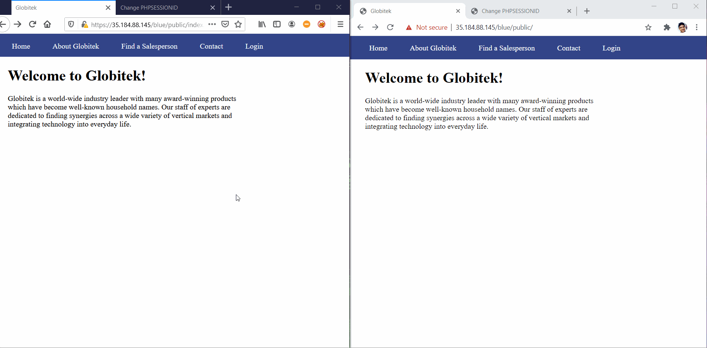
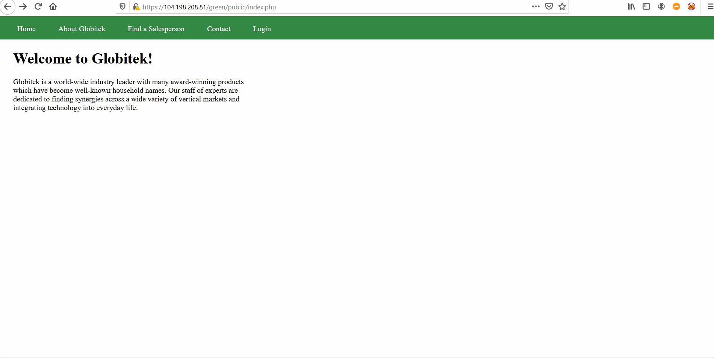

# Project 8 - Pentesting Live Targets

Time spent: **7** hours spent in total

> Objective: Identify vulnerabilities in three different versions of the Globitek website: blue, green, and red.

The six possible exploits are:

* Username Enumeration
* Insecure Direct Object Reference (IDOR)
* SQL Injection (SQLi)
* Cross-Site Scripting (XSS)
* Cross-Site Request Forgery (CSRF)
* Session Hijacking/Fixation

Each color is vulnerable to only 2 of the 6 possible exploits. First discover which color has the specific vulnerability, then write a short description of how to exploit it, and finally demonstrate it using screenshots compiled into a GIF.

## Blue

Vulnerability #1: Session Hijacking/Fixation

Description: Session Hijacking allows an attacker to steal the active session of a user to gain access to actions and information on the user's website. Session Fixation allows an attacker to provide a user with a session identifier for the attacker to gain information and actions from the user's website. 

Vulnerability #2: __________________

Description:

## Green

Vulnerability #1: Cross-Site Scripting

Description: Cross Site Scripting allows an attacker to run malicious JavaScripts on a user's website. Cross Site Scripting works when the attacker sends a malicious Javascript to the user of the website from a message that the attacker sends to the user on the user's website. When the user accesses the message of the attacker on the website, the malicious Javascript will be run on the user website.

Vulnerability #2: __________________

Description:

## Red

Vulnerability #1: Insecure Direct Object Reference

Description: Insecure Direct Object Reference allows a user to access a restricted resource based on the input of the user. Insecure Direct Object Reference works when a user manipulates an object in the url such as an ID in order for the user to access a page that is meant to be restricted to them.

Vulnerability #2: __________________

Description:

## Notes

Describe any challenges encountered while doing the work
