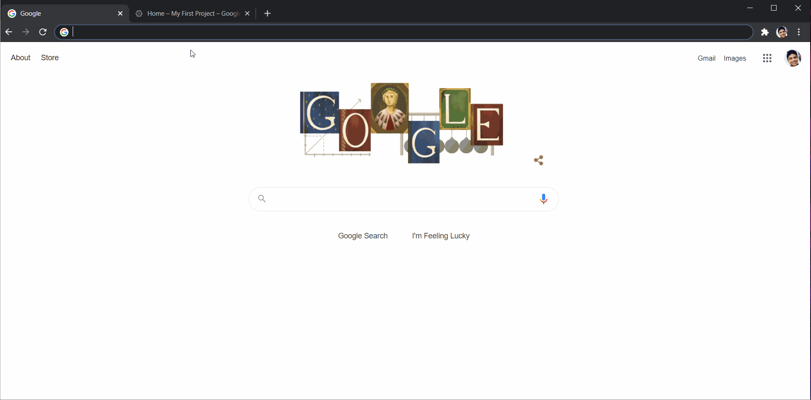
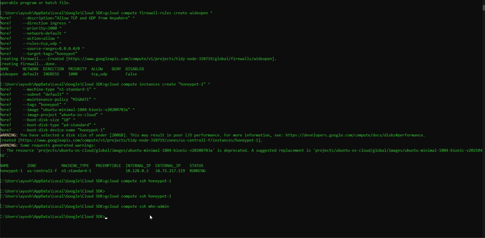

# Honeypot Assignment

**Time spent:** **X** hours spent in total

**Objective:** Create a honeynet using MHN-Admin. Present your findings as if you were requested to give a brief report of the current state of Internet security. Assume that your audience is a current employer who is questioning why the company should allocate anymore resources to the IT security team.

### MHN-Admin Deployment (Required)

**Summary:** How did you deploy it? Did you use GCP, AWS, Azure, Vagrant, VirtualBox, etc.?
In order to for me to deploy MHN-Admin, I had to create the MHN-Admin VM and install the MHM-Admin application and I used GCP in order to create the MHN-Admin VM and install the MHN-Admin application. Before creating the MHN-Admin VM and installing the MHN-Admin application, I first had to install the GCP SDK on my local machine and initialize the GCP SDK by using the command `gcloud init` on the Google Cloud SDK Shell. After initializing the GCP SDK, I set a default region by using the command `gcloud config set compute/region us-central1` and I set a default zone by using the command `gcloud config set compute/zone us-central1-f`. After setting a default region and zone, I ran the command `gcloud config list` to see that I had configured my project, region, and zone right. In order to create the MHN-Admin VM, I had to create the firewall rules that will allow for the MHN-Admin's inbound ports to be enabled by using the following commands on the Google Cloud SDK Shell.

```
gcloud compute firewall-rules list

gcloud compute firewall-rules create http ^
    --allow tcp:80 ^
    --description="Allow HTTP from Anywhere" ^
    --direction ingress ^
    --target-tags="mhn-admin"

gcloud compute firewall-rules create honeymap ^
    --allow tcp:3000 ^
    --description="Allow HoneyMap Feature from Anywhere" ^
    --direction ingress ^
    --target-tags="mhn-admin"

gcloud compute firewall-rules create hpfeeds ^
    --allow tcp:10000 ^
    --description="Allow HPFeeds from Anywhere" ^
    --direction ingress ^
    --target-tags="mhn-admin"
```
After using the following commands to allow for the MHN-Admin's inbound ports to be enabled, I created the MHN-Admin VM by using the following command.
```
gcloud compute instances create "mhn-admin" ^
    --machine-type "n1-standard-1" ^
    --subnet "default" ^
    --maintenance-policy "MIGRATE" ^
    --tags "mhn-admin" ^
    --image "ubuntu-minimal-1804-bionic-v20200703a" ^
    --image-project "ubuntu-os-cloud" ^
    --boot-disk-size "10" ^
    --boot-disk-type "pd-standard" ^
    --boot-disk-device-name "mhn-admin"
```
After using the following command to create the MHN-Admin, I was able to run MHN-Admin VM by using the command `gcloud compute ssh mhn-admin`. After creating the MHN-Admin, I had to install the MHN-Admin application in order to deploy the MHN-Admin. In order to install the MHN-Admin application , I first had to run the MHN-Admin VM and after running MHN-Admin VM, I had to use the following command to get the latest packages and to have some dependencies be installed.
```
sudo apt update
sudo apt install git python-magic -y
```
After getting the latest packages and having some dependies be installed, I downloaded MHN and changed the version of FLASK-SQLAlchemy from 2.3.2 to 2.5.1 by using the following commands on MHN-Admin VM.
```
cd /opt/
sudo git clone https://github.com/pwnlandia/mhn.git
cd mhn/
cd server
sudo apt install nano
sudo nano requirements.txt
```
After using the following command to download MHN and change the version of FLASK-SQLAlchemy from 2.3.2 to 2.5.1, I installed MHN by using the following commands.
```
cd ..
sudo ./install.sh
```
After installing MHN by using the following command, I can deploy MHN-Admin by loading the external IP of the MHN-Admin, which is 35.239.165.255, in a browser and logging onto the admin console. I used GCP in order for me to deploy the MHN-Admin.



### Dionaea Honeypot Deployment (Required)

**Summary:** Briefly in your own words, what does dionaea do?
Dionaea is a honeypot that catches the binaries of malware samples. In order for me to deploy Dionaea Honeypot, I first had to create a firewall rule that will have all ports for the honeypot sensors to allow the incoming UDP and TCP traffic by using the following command.
```
gcloud compute firewall-rules create wideopen ^
    --description="Allow TCP and UDP from Anywhere" ^
    --direction ingress ^
    --priority=1000 ^
    --network=default ^
    --action=allow ^
    --rules=tcp,udp ^
    --source-ranges=0.0.0.0/0 ^
    --target-tags="honeypot"
```
After using the following command to create a firewall rule that will allow for the honeypot sensors to allow the incoming UDP and TCP traffic, I created a VM for the Dionaea Honeypot by using the following command.
```
gcloud compute instances create "honeypot-1" ^
    --machine-type "n1-standard-1" ^
    --subnet "default" ^
    --maintenance-policy "MIGRATE" ^
    --tags "honeypot" ^
    --image "ubuntu-minimal-1804-bionic-v20200703a" ^
    --image-project "ubuntu-os-cloud" ^
    --boot-disk-size "10" ^
    --boot-disk-type "pd-standard" ^
    --boot-disk-device-name "honeypot-1"
```
After using the following command to create the VM for the Dionaea Honeypot, I used the command `gcloud compute ssh honeypot-1` to run the VM for the Dionaea Honeypot. After running the VM for the Dionaea Honey, I used the command `wget "http://35.239.165.255/api/script/?text=true&script_id=2" -O deploy.sh && sudo bash deploy.sh http://35.239.165.255 WocfRze8` in the Dionaea Honeypot VM to install the sortware for the Dionaea Honeypot and to deploy the Dionaea Honeypot. After deploying the Dionaea Honeypot, I was able to attract attackers to attack the Dionaea Honeypot in order for the Dionaea Honeypot to catch the binaries of malware samples.



### Database Backup (Required) 

**Summary:** What is the RDBMS that MHN-Admin uses? What information does the exported JSON file record?
The RDBMS that MHN-Admin uses is MongoDB. The information that the exported JSON file records is ID, Protocol, HPFeed ID, timestamp, source IP, Source Port, Destination Port, Identifier, and Honeypot of each of the attacks on the MHN-Admin. In order for me to export the data that the Dionaea Honeypot had collected, I first ran the MHN-Admin VM and I then used the command `mongoexport --db mnemosyne --collection session > session.json` in the MHN-Admin VM to export the data that the Dionaea Honeypot had collected to a JSON format. After running the command in the MHN-Admin to export the data that the Dionaea Honeypot had collected to a JSON format, a new file called session.json was created in my current working directory and I used the command `truncate --size="<5M" session.json` in order for GitHub to be able to handle the session.json file. After using the following command for GitHub to be able to handle the sessio.json file, I used the command `gcloud compute scp mhn-admin:./session.json ./session.json` to copy the session.json file onto my computer After copying the session.json file onto my computer, I was able to locate the session.json file on my computer and upload the session.json file onto GitHub to proof of the data that the Dionaea Honeypot had collected.

*Be sure to upload session.json directly to this GitHub repo/branch in order to get full credit.*

### Deploying Additional Honeypot(s) (Optional)

#### X Honeypot

**Summary:** What does this honeypot simulate and do for a security researcher?


### Malware Capture and Identification (Optional)

#### X Malware

**Summary:** How did you find it? Which honeypot captured it? What does each malware do?

MD5 Hash: *Run `md5sum` on the file and record the hash here.*

SHA1 Hash: *Run `sha1sum` on the file and record the hash here.*


## Notes

Describe any challenges encountered while doing the assignment.
